# 🚆 Train Ticket Reservation System

A full-stack **Java Web Application** that provides an end-to-end solution for **online train information, ticket booking, and reservation management**.  
The system enables users to search trains, check seat availability, enquire fares, book tickets securely, and manage their profiles, while administrators manage train schedules and operations efficiently.

---

## 📖 About the Project

The **Train Ticket Reservation System** is designed to automate the traditional train enquiry and reservation process.  
It offers a **secure, user-friendly, and scalable platform** that simulates real-world railway reservation features such as:

- Train schedule management  
- Seat availability checking  
- Fare enquiry  
- Secure ticket booking  
- Role-based access (Admin & User)

This project follows **MVC architecture** and Java EE best practices.

---

## 🎯 Project Objectives

- Automate the train reservation process
- Reduce manual effort and human errors
- Provide fast and accurate train information
- Ensure secure authentication and authorization
- Implement clean, modular, and maintainable code

---

## 🌐 Online Train Information & Reservation

### 🔹 Core Features

- View Train Schedules  
- Search Trains by Number or Stations  
- Check Seat Availability  
- View Train Timings  
- Fare Enquiry  
- Trains Between Two Stations  
- Online Seat Booking  
- Secure Login & Logout  
- Password Management  
- Payment Gateway Simulation  
- Ticket Booking History  

---

## 👨‍💼 Admin Module

**Admin has full control over train operations:**

- Admin Login  
- Add New Trains  
- Update Train Details  
- Cancel / Remove Trains  
- View All Trains  
- Search Train by Number  
- Edit Admin Profile  
- Secure Logout  

---

## 👤 User Module

**Registered users can:**

- Register & Login  
- View Available Trains  
- Search Trains  
- Check Seat Availability  
- View Trains Between Stations  
- Fare Enquiry  
- Book Tickets Online  
- View Booking History  
- View & Update Profile  
- Change Password  
- Secure Logout  

---

## 🛠️ Technologies Used

### 🔹 Front-End
- HTML  
- CSS  
- Bootstrap  

### 🔹 Back-End
- Java (J2EE)  
- Servlets  
- JDBC  

### 🔹 Database
- MySQL (SQL)  

---

## 🧰 Software & Tools Required

- Git & GitHub  
- Java JDK 8+  
- Eclipse IDE (Enterprise Edition)  
- Apache Maven  
- Apache Tomcat v8.0+  
- MySQL Server  
- MySQL Workbench  

---

## 🗂️ Project Architecture

- **MVC Architecture**
  - **Model** → Java Beans & DAO  
  - **View** → JSP, HTML, CSS  
  - **Controller** → Servlets  
- Clean separation of concerns  
- Secure database interaction using JDBC  

---

## 🗄️ Database Initialization (Dummy Data)

### Step 1: Open MySQL Workbench  
### Step 2: Login using administrator credentials  
### Step 3: Execute the following SQL script 

```SQL

CREATE DATABASE IF NOT EXISTS reservation;
USE reservation;

CREATE TABLE customer (
    mailid VARCHAR(40) PRIMARY KEY,
    pword VARCHAR(20) NOT NULL,
    fname VARCHAR(20) NOT NULL,
    lname VARCHAR(20),
    addr VARCHAR(100),
    phno BIGINT NOT NULL
);

CREATE TABLE admin (
    mailid VARCHAR(40) PRIMARY KEY,
    pword VARCHAR(20) NOT NULL,
    fname VARCHAR(20) NOT NULL,
    lname VARCHAR(20),
    addr VARCHAR(100),
    phno BIGINT NOT NULL
);

CREATE TABLE train (
    tr_no INT PRIMARY KEY,
    tr_name VARCHAR(70) NOT NULL,
    from_stn VARCHAR(20) NOT NULL,
    to_stn VARCHAR(20) NOT NULL,
    seats INT NOT NULL,
    fare DECIMAL(8,2) NOT NULL
);

CREATE TABLE history (
    transid VARCHAR(36) PRIMARY KEY,
    mailid VARCHAR(40),
    tr_no INT,
    travel_date DATE,
    from_stn VARCHAR(20) NOT NULL,
    to_stn VARCHAR(20) NOT NULL,
    seats INT NOT NULL,
    amount DECIMAL(10,2) NOT NULL,

    CONSTRAINT fk_history_customer 
        FOREIGN KEY (mailid) REFERENCES customer(mailid),

    CONSTRAINT fk_history_train 
        FOREIGN KEY (tr_no) REFERENCES train(tr_no)
);

INSERT INTO admin VALUES
('admin@demo.com','admin','System','Admin','Demo Address 123 colony',9874561230);

INSERT INTO customer VALUEs
('aakashbabar9192@gmail.com ','Akash','Akash','Babar','Mumbai, Maharashtra',9820294243);

INSERT INTO train VALUES
(10001,'JODHPUR EXP','HOWRAH','JODHPUR',152,490.50),
(10002,'YAMUNA EXP','GAYA','DELHI',52,550.50),
(10003,'NILANCHAL EXP','GAYA','HOWRAH',92,451.00),
(10004,'JAN SATABDI EXP','RANCHI','PATNA',182,550.00),
(10005,'GANGE EXP','MUMBAI','KERALA',12,945.00),
(10006,'GARIB RATH EXP','PATNA','DELHI',1,1450.75);


INSERT INTO history VALUES
('BBC374-NSDF-4673','aksh@demo.com',10001,'2024-02-02','HOWRAH','JODHPUR',2,981.00),
('BBC375-NSDF-4675','akash@demo.com',10004,'2024-01-12','RANCHI','PATNA',1,550.00),
('BBC373-NSDF-4674','aki@demo.com',10006,'2024-07-22','PATNA','DELHI',3,4352.25);

COMMIT;


SELECT * FROM ADMIN;
SELECT * FROM CUSTOMER;
SELECT * FROM TRAIN;
SELECT * FROM HISTORY;

```


### The Screenshots of some of the  webPages of this project are Here:

1. Login Page
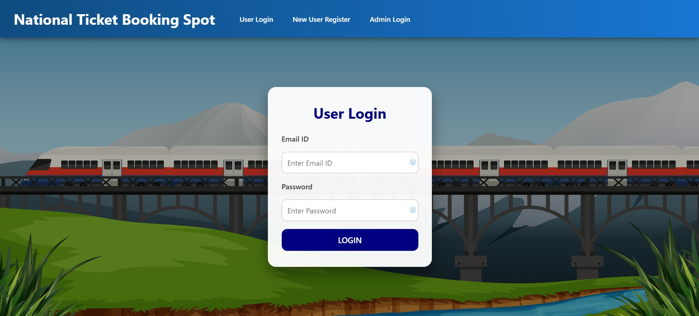

2. Register New User
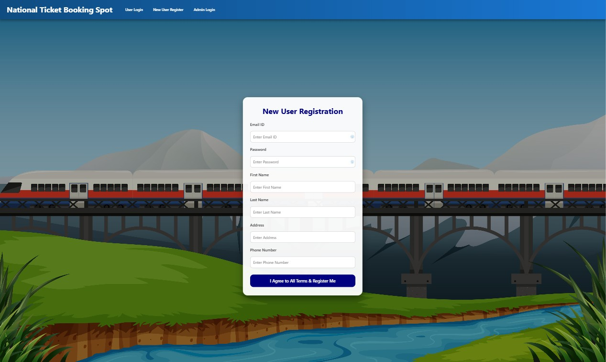

3. User Home
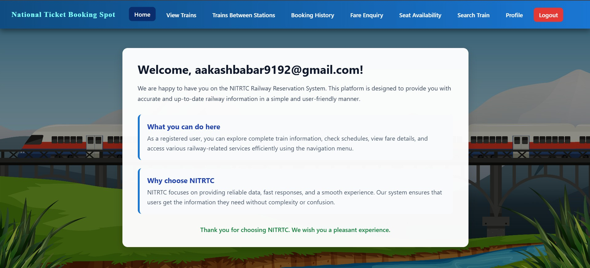

4. User View Trains
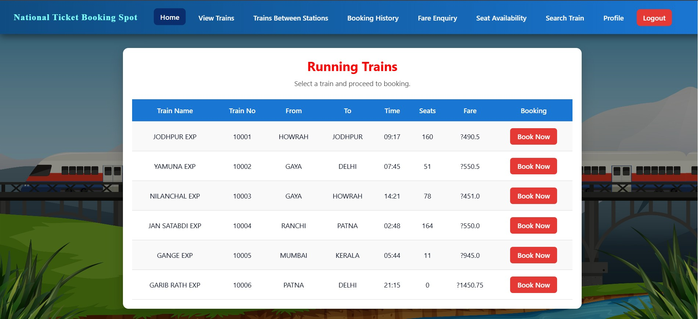

5. User Book Train
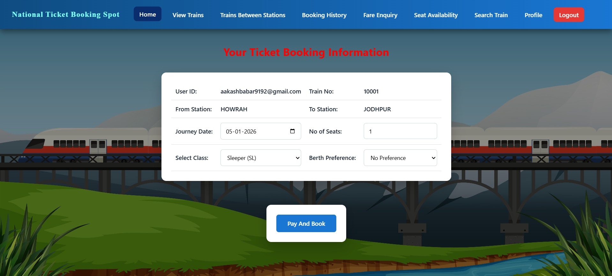

6. User Payment
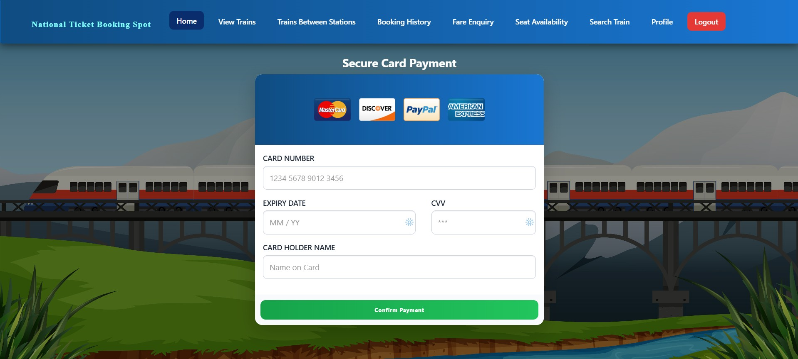

7. User Trains Between Stations
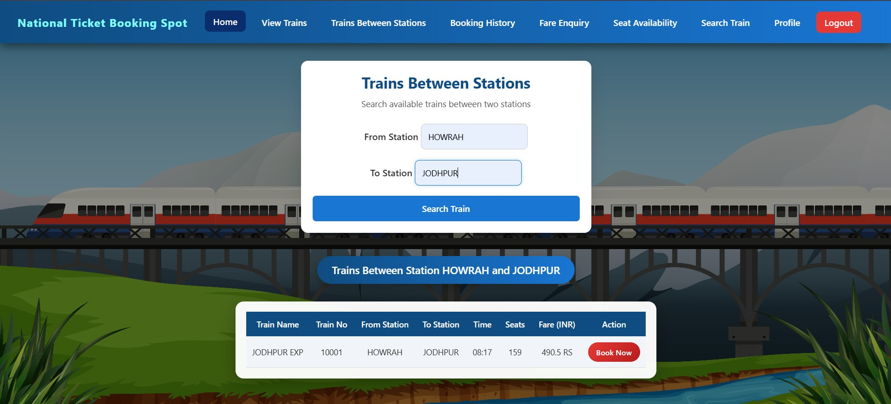

8. User Train Booking History


9. User Fare Enquiry
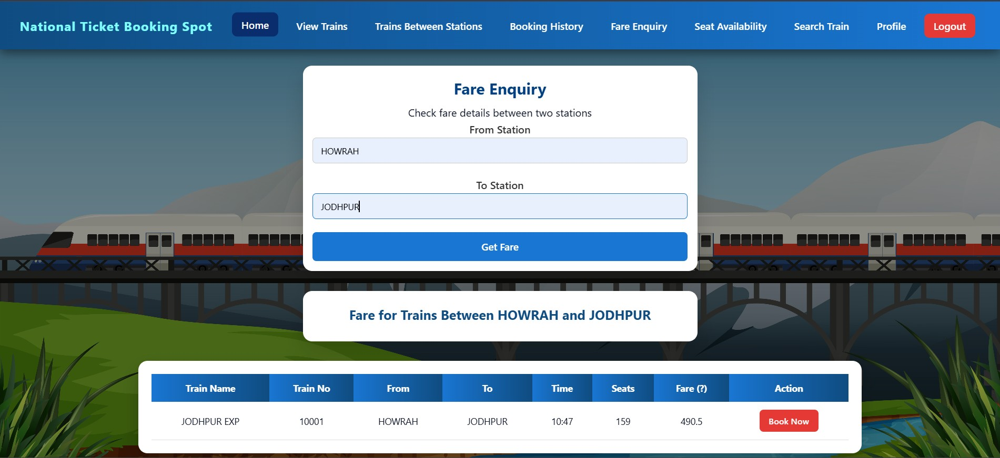

10. User Seat Availability
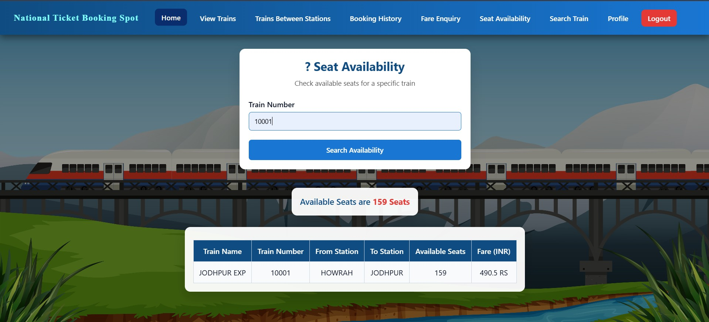

11. User Search Train By Number
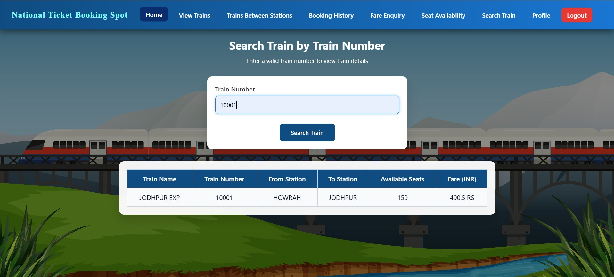

12. User Profile
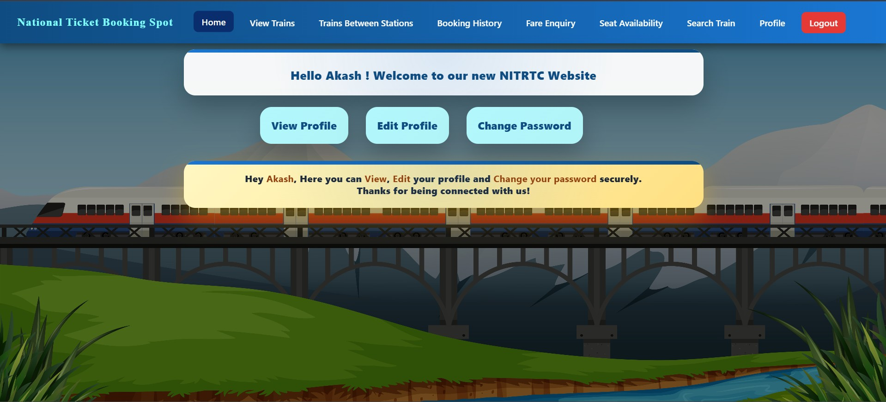

13. User View Profile
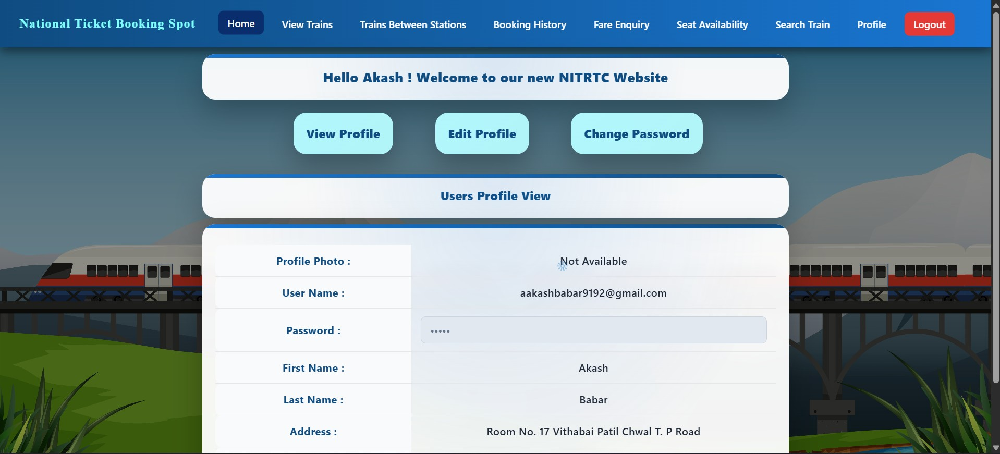

14. User Edit Profile
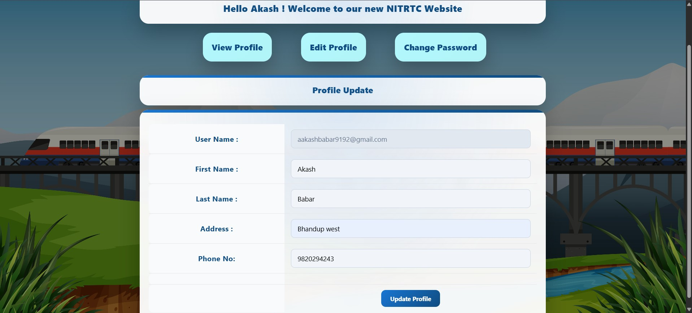

15. User Change Password Profile
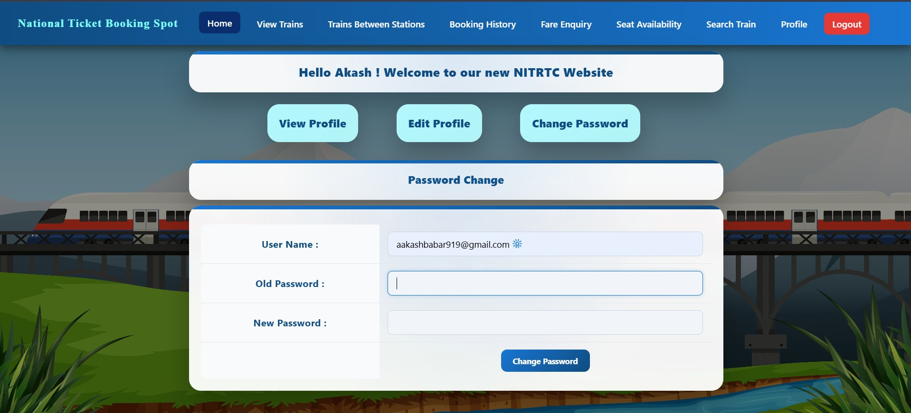

16. Admin Login
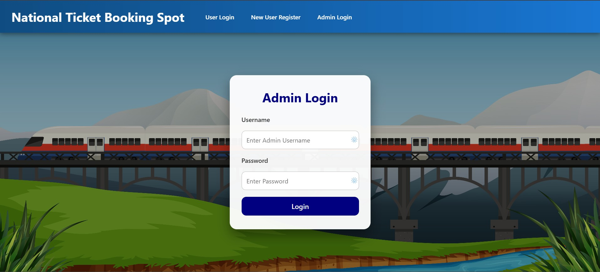

17. Admin Home
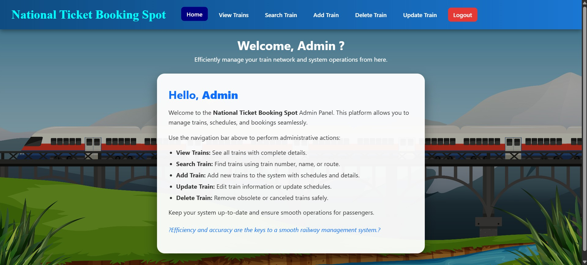

18. Admin View Trains
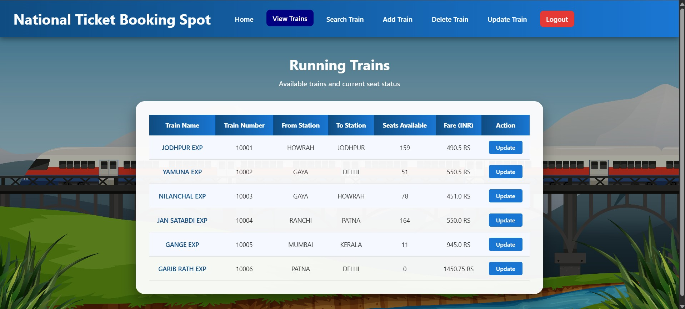

19. Admin Search Train
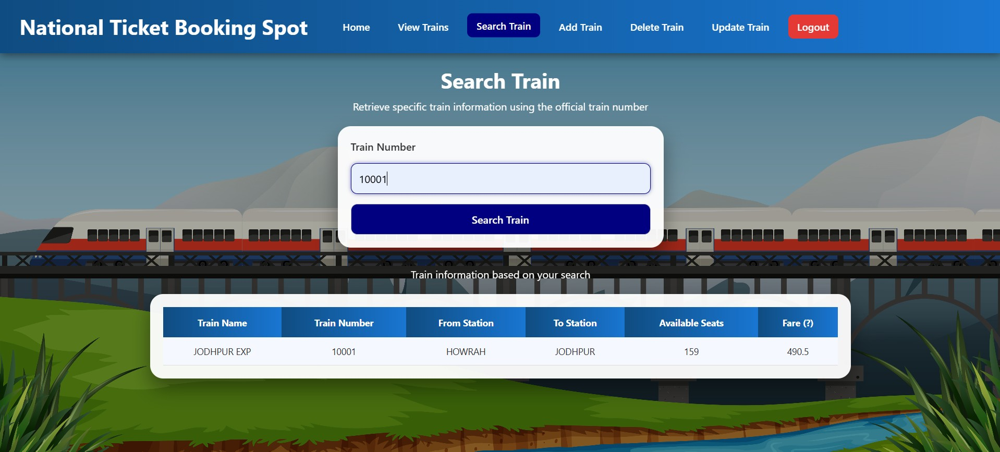

20. Admin Add Train
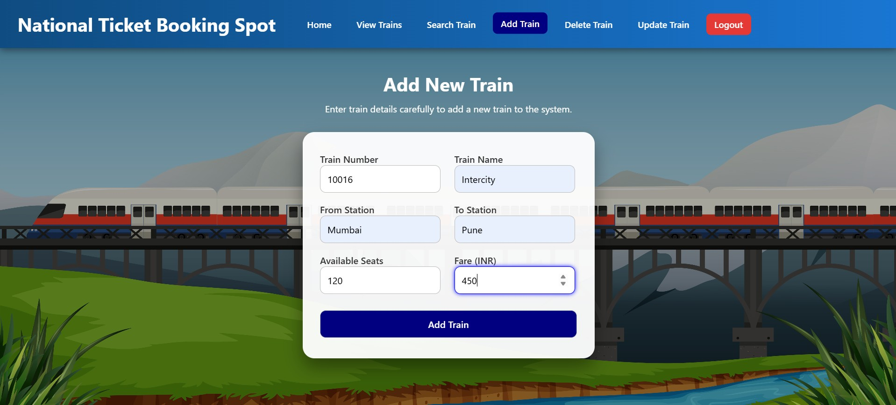

21. Admin Cancel Train
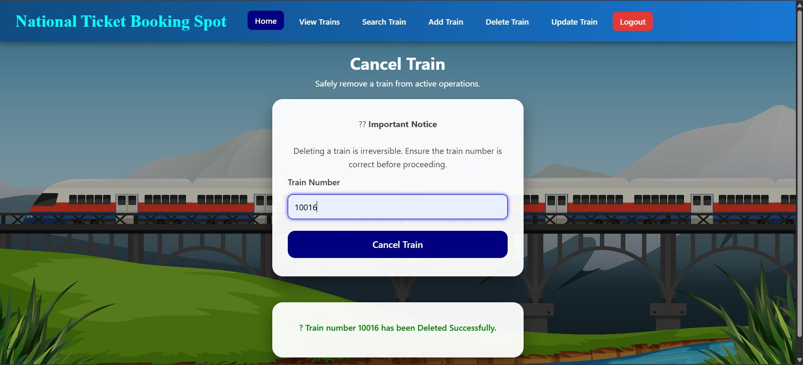

22. Admin Update Train
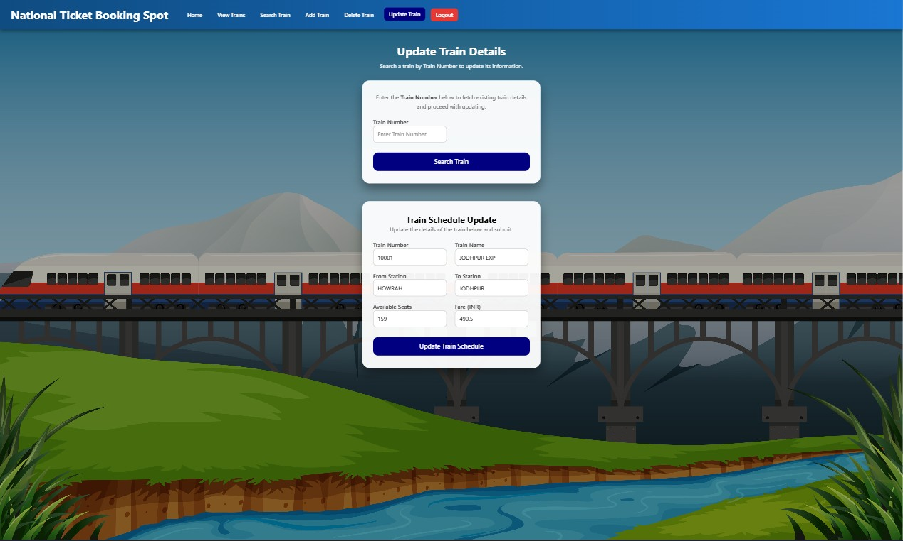


## ⭐ Feedback & Suggestions

Suggestions and improvements are always welcome.  
Feel free to raise an issue or submit a pull request to help enhance this project.

---

**Akash Babar**  
Java Full Stack Developer  
